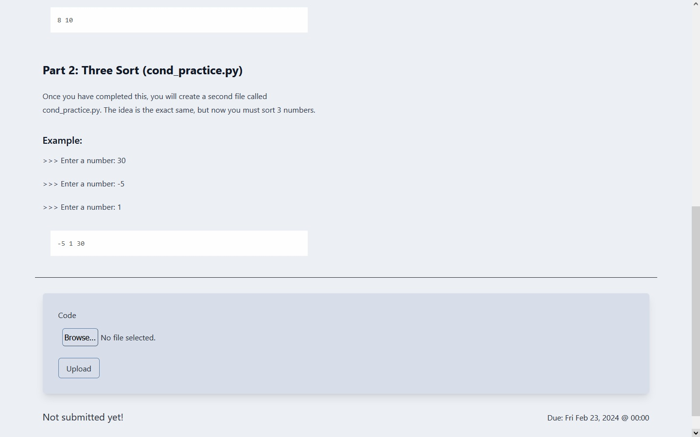
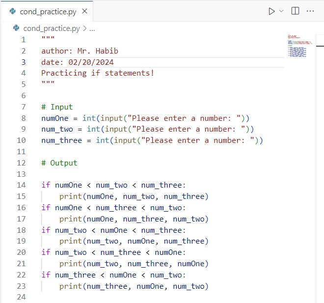
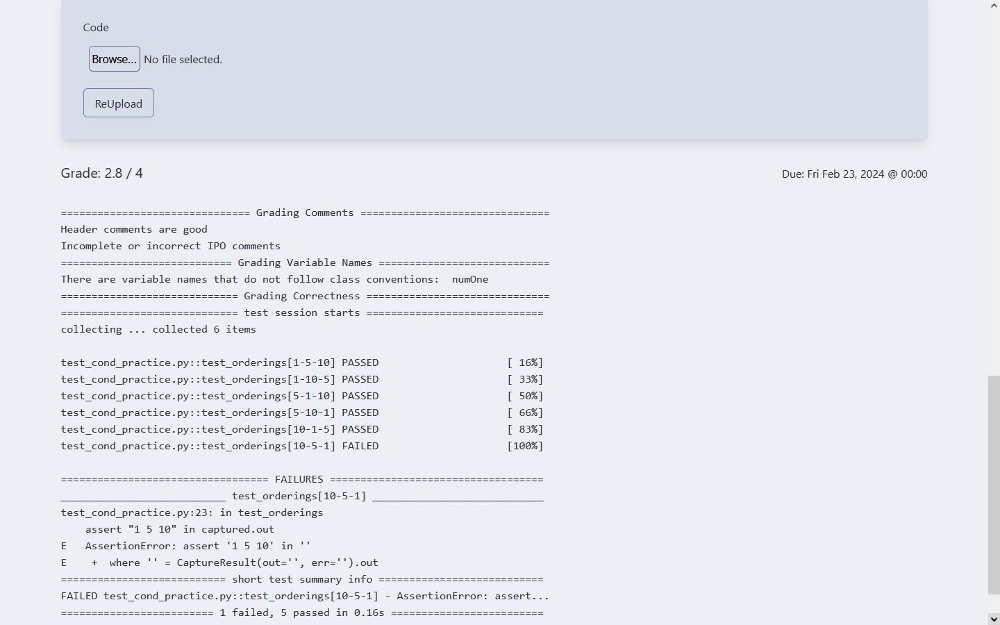

# Pycs Autograder

Pycs is an autograder designed to streamline the assignment submission and grading process for students and teachers in ICS3U and ICS4U courses. It allows users to register, sign in, join classes, view assignments, submit assignments, and receive grades along with feedback.

## Features

- **User Authentication:** Students can register and sign in securely to access the autograder functionality.
  
- **Class Management:** Users can join classes to view and submit assignments.

- **Assignment Submission:** Students can submit assignments with filenames matching the requirements.

- **Grading System:** Assignments are graded out of 4, with additional feedback on variable names, comments, header comments, and docstrings.

- **Pytest Integration:** Users can view the output of pytest to assess the success of their submissions.

## The process

Students read a description of the assignment



Try to complete the assignment



Submit it to pycs, and look at their errors



Keep trying and trying until they manage to get a 4/4, passing all of the unit tests, and class conventions!

## Getting Started

Visit [https://pycs.philiph.dev/](https://pycs.philiph.dev/) to use Pycs. Currently, I'm the only teacher account on this hosted version (I don't pay enough to DigitalOcean to have this be the server for anyone else who would want to use it.)

## Building Pycs Yourself

## Requirements

- [Python](https://www.python.org/downloads/) (version 3.8.x)
- [Git](https://www.git-scm.com/downloads)
- Some time for poking around
  
### Installation

1. Clone the repository:

    ```bash
    git clone https://github.com/philip-h/pycs.git
    ```

2. Install dependencies:

    ```bash
    cd pycs
    yarn
    pip install -r requirements.txt
    ```

3. Run the application in developper mode:

    ```bash
    yarn run
    ```

4. Access the application at `http://localhost:5000` in your browser.

## Usage

1. Register or sign in to your Pycs account.
2. Join a class using the provided class code (Currently, it's hardcoded as classone and classtwo for my use. Change this if you desire in pycs/controllers/user.py#def add_student_to_class).
3. View assignments for the class and read instructions carefully.
4. Submit assignments with filenames matching the specified requirements.
5. Check grades and detailed feedback.

## Contact

For any inquiries or feedback, please contact [philip.habib6347@gmail.com].


